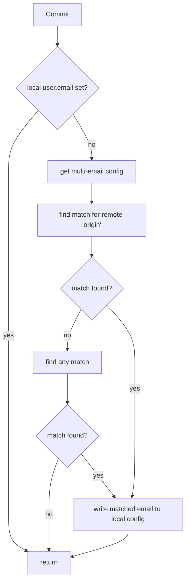

# multi-email-git-hook

Yet another Git hook to set user.email based on remote.

## Installing
Make sure you have these packages installed:
- git
- perl
- make (for install)

#### Manual
Install `pre-commit.pl` to the [`init.templateDir`][template-dir] as `pre-commit`. e.g:
```
$ mkdir ~/.git-template-dir
$ cp pre-commit.pl ~/.git-template-dir/pre-commit
$ git config --global init.templateDir ~/.git-template-dir
```

#### Using make
This will install the hook to you `$XDG_DATA_HOME` and set `init.templateDir` accordingly.
```
$ make install
```

If you already have `init.templateDir` set the install will exit as a precausion. Unset this first if you are sure it will not break anything and run `make install` again.

To unset it:
```
$ git config --global --unset init.templateDir
```

[template-dir]:https://git-scm.com/docs/git-init#_template_directory

## Configuration
This hook is configured in the global user [`gitconfig`][gitconfig]. Preferably by using the `git config` command.

Multi-email hook uses 'organization' sections that consist of a 'match' URI and an e-mail address.
To set/create such a section:
```
$ git config --global multi-email.company1.match gitlab.com:company1
$ git config --global multi-email.company1.email me@company1.com
```
And another:
```
$ git config --global multi-email.company2.match gitlab.com:company2
$ git config --global multi-email.company2.email me@company2.io
```
```
$ cat ~/.gitconfig
[multi-email "company1"]
	match = gitlab.com:company1
	email = me@company1.com
[multi-email "company2"]
	match = gitlab.com:company2
	email = me@company2.io
```

Commits made to repositories with an origin that matches "gitlab.com:company1" will now use the e-mail address "me@company1.com".

A remote named 'origin' is used as the preferred value.

[gitconfig]:https://git-scm.com/docs/git-config#FILES

## Usage
**The hook will automatically be added to newly created/cloned repositories.
If you want to add it to an existing repository copy it to `$repo/.git/hooks/`.**

On first commit the hook will configure the local `user.email` setting.

```
~/work/pelle_hwky/multi-email-git-hook develop* ⇡
❯ git add README.md

~/work/pelle_hwky/multi-email-git-hook develop* ⇡
❯ git commit -v
Setting local user.email = pelle@hwky.ai
Commit again if this is correct.
```
If this is correct commit again:
```
~/work/pelle_hwky/multi-email-git-hook develop* ⇡
❯ git commit -v
[develop b9e8d59] update README
 1 file changed, 1 insertion(+), 3 deletions(-)
```
```
~/work/pelle_hwky/multi-email-git-hook develop* ⇡
❯ git show --pretty=full
commit b9e8d59efa32f1d62157b5e2376779f286288efe (HEAD -> develop)
Author: Pelle van Gils <pelle@hwky.ai>
Commit: Pelle van Gils <pelle@hwky.ai>

    update README
...
```

## Flow


## References
- https://git-scm.com/docs/githooks
- https://github.com/DrVanScott/git-clone-init
- https://gist.github.com/dreness/2de62e01d2053f9440eb